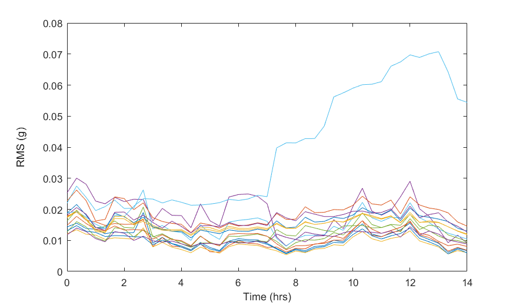
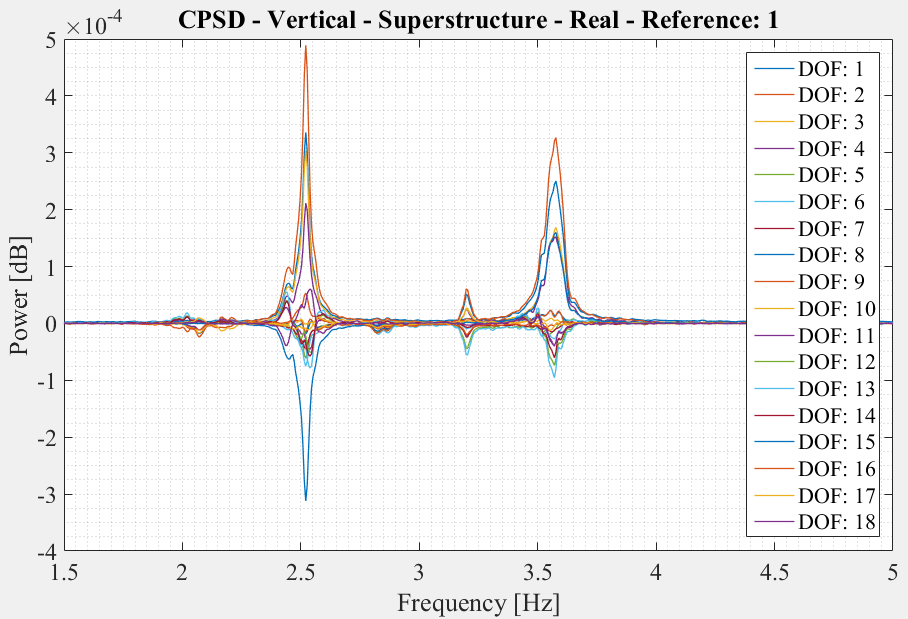

# Acceleration Results

A total of 30 accelerometers were installed and more than 12 hours of data recorded. Data was sampled at 200 Hz which allows for identification of modes of vibration as high as 100 Hz.

## Time History

The a low-pass filter was applied to the acceleration data in an effort to remove high frequency acceleration (above 20 Hz) from sources such as noise and member local modes that could cloud global vibration characteristics.
The root mean square was calculated for every 20 minute period of the data to track the change in the level of excitation over time.

As can be seen from the above plot, the superstructure experiences relatively steady vibration and it increases toward the latter half of the total record. This time corresponds to the period between 12:00 PM and 3:30 PM.
The maximum RMS values for the superstructure range from 0.015 to 0.07 g. In contrast, the RMS values for the pier accelerometers did not exceed 0.003 g. This is due to the effectiveness of the bearings, isolating the pier from superstructure vibrations, and the comparatively large axial stiffness of the piers which limits (and effectively prevents) vertical pier acceleration: the direction for which the superstructure experiences the greatest vibration.  

## Vibration Characterization

The acceleration data was analyzed using Fourier transform methods to extract information about the acceleration at specific frequencies.

Several modes of vibration were found at frequencies below 5 Hz. The image above shows the power of each frequency. The peaks in the plots are poles where a mode of vibration is occurring, and for this structure, a natural frequency. In some instances, poles are at very similar frequency and the separate peaks cannot be easily distinguished. This is due to the geometry of the structure (high degree of symmetry) and the fact that there are essentially two identical bridges adjacent to one another.
The main modes identified by this effort consisted of bending and torsional modes. For these modes, the mid-span degrees of freedom are experiencing the greatest acceleration. The shape of several of these modes are displayed below.

|Mode with One Side Active|Mode with Spans Out of Phase|Mode with Spans in Phase |
|--|--|--|
||||
