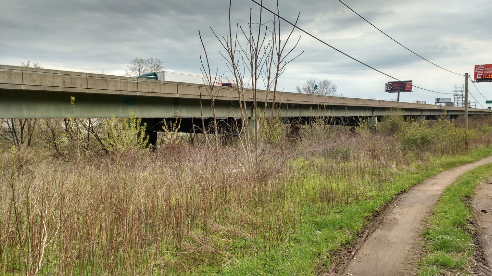
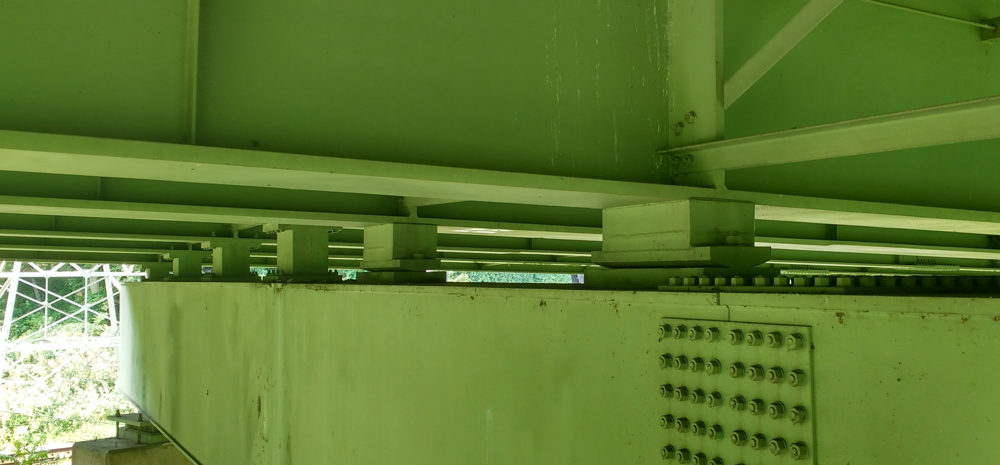

## Test Structure Description

### Description
The viaduct was first constructed in 1952. The superstructure was replaced in 1986, while reusing the original piers and foundations. The structure runs along the banks of the Schuylkill River and carries the Schuylkill Expressway (I-76) with a total of four lanes of traffic. Bridge users have reported experiencing unusually high levels of vibration while on the structure.
### Network
The bridge is located on a major highway and carries more than 57,000 vehicles a day with 4% truck traffic. The bridge spans an access road and a railroad (spans 9 & 10). Testing of this bridge will not require access in the vicinity of the railroad.

### Superstructure
The structural type is steel multi-girder. Eight girders run longitudinally, resting on steel box girders that span transversely and are supported by the concrete piers. A reinforced concrete composite deck was cast in place, with a “raked” finish and no overlay. There is no skew. The bridge has eleven spans. The maximum span length is 140’-0”. The out-to-out width is 76’-6”. Three spans are simply supported, while the remaining eight are two-span continuous. Each span has five interior rows of X-framed diaphragms and chevron diaphragms over the piers.

### Substructure and Bearings
The concrete piers and abutments were constructed in 1952 and are all that remains of the original structure. They are supported by driven piles. Elastomeric bearing pads are installed on top of the piers and support the transverse box girders. Rocker bearings or pedestals are installed between the box girders and longitudinal girders at those locations which are in the center of continuous spans. Elastomeric bearings are installed between the box girder and the longitudinal girders at the remaining locations.

### Condition
Visually, the deck appears to be in good condition, with no major cracking visible. Minor damage was observed in some regions of the center concrete barrier. The girders appeared in excellent condition. No major rusting was observed, and the girders appeared well maintained. The access hatches on many of the box girders had been left open. Any ill effects from this could not be immediately observed. The piers exhibited very little efflorescence and virtually no spalling. Repairs had been performed on several piers, where an embedded drainage pipe had rusted and cause a portion of concrete to spall off.

|NBI Structure Number |	000000000027280 |
|------|-----|
|Year Reconstructed | 	1986|
|Owner	| PennDOT|
|Skew	| 0 degrees|
|Deck Width |	76’-6”|
|Maximum Span Length	| 140’-0”|
|ADT	| 57410 (2013)|
|Deck Condition	| 6 (Satisfactory Condition)|
|Superstructure Condition	| 7 (Good Condition)|
|Substructure Condition	| 5 (Fair Condition)|
|Sufficiency Rating	| 70|
