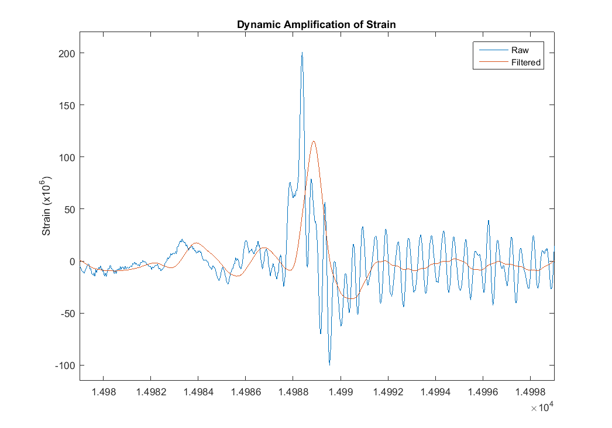

## Strain Results
### Operational Strain and Stress
A total of 12 strain gauges were installed and data recorded for more than 24 hours. Gauges were sampled at 50 Hz which allowed us to capture the dynamic behavior of the bridge.

Strain levels in excess of 100 microstrain (3 ksi) were not uncommon, and occasional responses as high as 6 ksi were recorded in the bottom flange of longitudinal girders at mid-span. The interior girders (supported at the center of the box girder) experienced the highest responses.
A low pass filter was applied to the data to remove the data associated with frequencies above 1.5 Hz, thus permitting the dynamic response of the bridge to be removed from the data and only the static response of the bridge to be plotted.

### Dynamic Amplification
The strain data plotted above has been filtered to show only the static response. The additional strain due to the vibration of the bridge is neglected. However, the portion of strain due to the dynamic response (vibration) of this structure is significant. The plot below is during a large event. The static response accounts for over 100 microstrain, but the vibration of the structure causes the total response to exceed 200 microstrain.
For this event, an amplification of the static response by approximately 75% is observed. In comparison, the amplification applied for bridge design is only 33% or less.

This level of amplification is on the upper end of what researchers and transportation organizations have measured. However, the fact that the high amplification occurs regularly and even with large events, makes the nature of this bridge's response quite novel.
### Calculated Fatigue Life
As the magnitude and frequency of strain responses were quite high, a fatigue life analysis was performed to investigate whether the components at the sensor locations were in danger of fatigue failure.
A Rain Flow analysis with subsequent application of Miner's Rule was performed on the strain data collected to obtain estimates of fatigue life based on the cycles of strain measured. These fatigue life estimates are not for the entire structure, but only for those components that were instrumented and at the location of the installed gauge. Furthermore, the fatigue lives were based on the operational response of the structure during the two days of testing. This level of response, while expected to be representative of the typical response, is not guaranteed to be constant throughout the life of the bridge. Therefore, the quantities presented below serve to demonstrate the level of the structure's resistance to fatigue. They do not predict the time until fatigue failure.

#### Fatigue Life (years)

|Fatigue Category | BF MID G1 | BF MID G4 | BF MID G5 | BF 3/4 G4 | RIGHT BF | LEFT BF | XG MID BOT |
|-----------------|-----------|-----------|-----------|-----------|----------|---------|------------|
|A| 25042     | 9290.6    | 6513.8    | 49420     | 34513    | 32594   | 115360     |
|B| 12020     | 4459.5    | 3126.6    | 23722     | 16566    | 15645   | 55372      |
|C| 4407.4    | 1635.1    | 1146.4    | 8697.9    | 6074.2   | 5736.6  | 20303      |

These results suggest that in spite of high operational stress, these components are not vulnerable to fatigue.
