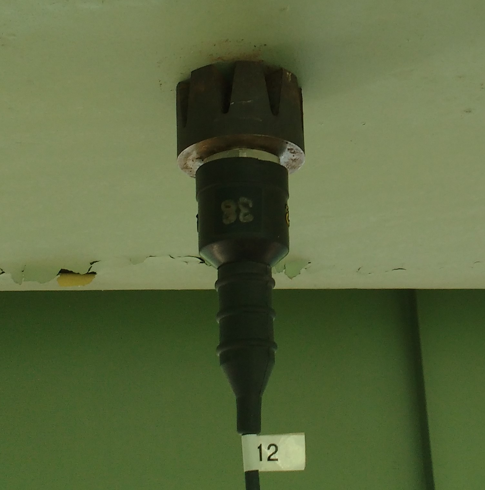

# Testing Activities
## Preliminary Survey of Cross Girder Acceleration
Preliminary testing of the viaduct took place on July 6th and 7th. The cross girders at piers 2, 3, 5 and 7 were instrumented with accelerometers.

The acceleration of these members due to traffic was recorded in an effort to determine the spans with the highest levels of vibration. The cross girders all experienced similar levels of vertical and longitudinal acceleration, while the cross girder at pier 7 experienced much higher transverse acceleration.

As a result, spans 7 and 8 were chosen for the in depth investigation.

## In Depth Vibration investigation

Instrumentation of spans 7 and 8 was performed on July 26th and 27th. Data was recorded on July 27th and 28th. Sensors were removed on July 29th.

|Accelerometer|Strain Gauge|
|--|--|
| |	 |

A total of 30 accelerometers (PCB Model 393A03) and 12 strain gauges (Geokon 6" vibrating wire) were installed on the chosen region of the viaduct. Epoxy was used to attach the strain gauges to the steel surface (after paint was removed).

They were located (as depicted in the images below) so as to capture maximum response as well as to characterize the mode (shape) of vibration.

### Accelerometer Instrumentation
Accelerometers were installed to the steel superstructure via magnets that were attached to the accelerometer base. Accelerometers were installed on the pier with hot-glue. Cables were run along the girders to Pier 7, and down to the ground at Pier 7. The accelerometers were sampled with National Instruments CompactRIO with 8 NI 9234 cards installed and using a LabVIEW acquisition program.
The acquisition system sampled at 200 Hz for multiple hours at a time over a period of 2 days, recording a total of 14 hours of data.

### Strain Gauge Layout
The locations where strain gauges were to be installed were identified and the paint removed with an angle grinder equipped with sandpaper disks until bare metal was exposed. This surface treatment is essential for proper adhesion of the gauge. Epoxy was applied to the strain gauge bases before being positioned on the treated surface. Duct tape was used to temporarily hold the gauge in place while the epoxy cured.
After at least 8 hours of curing the duct tape was removed, the gauge set screws were loosened and then retightened to release any intrinsic forces.
The cables were run along the girders toward Pier 7 and to the ground at Pier 7.
The strain gauges were sampled using a Campbell Scientific CR6 Datalogger with 2 CDM-VW305 8 Channel Vibrating Wire Analyzers. The system sampled at 50 Hz for 12 hours, and at 20 Hz for 8 hours during the night.

